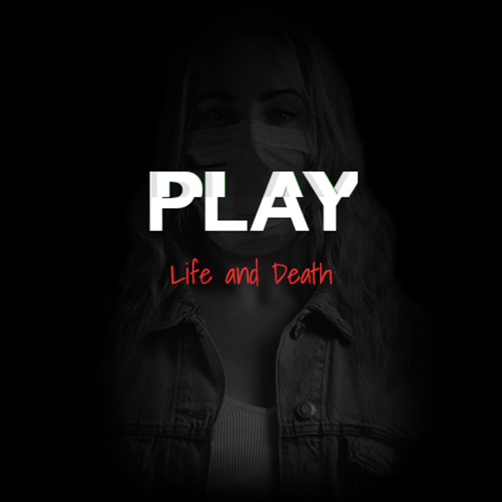
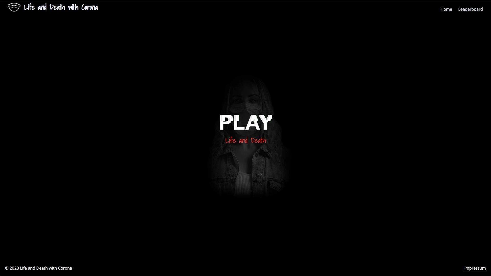
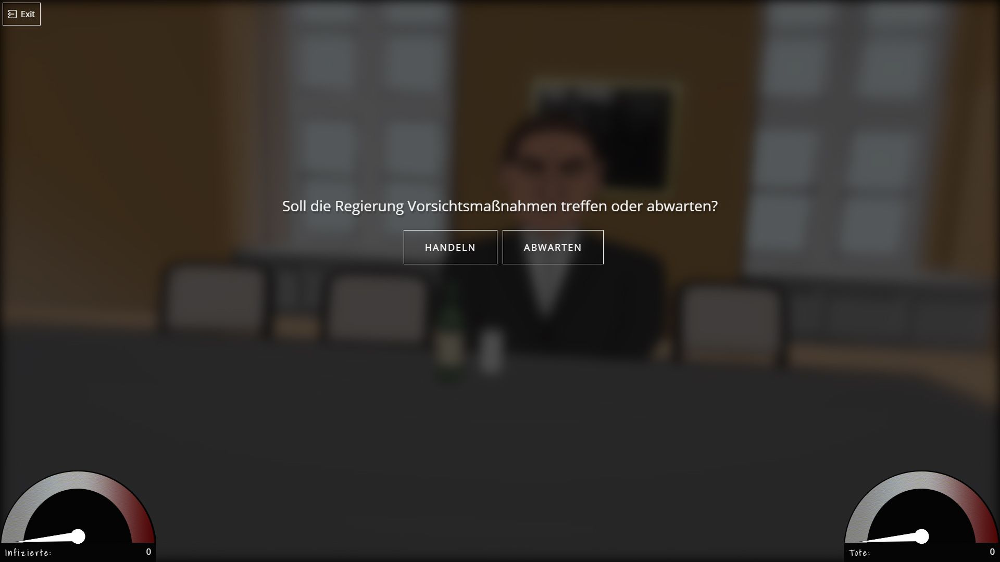
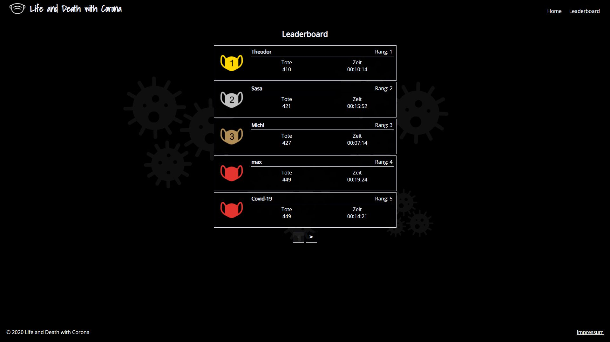

# Project-Life and death
Demo Videos 
- [Website](https://www.youtube.com/watch?v=WewHQCAEz1s&list=PLY6Og4oKy_DeqpGm1sZ_c1Dq_iQpcbOP3&index=1) 
- [Windows Desktop App](https://www.youtube.com/watch?v=yK_vE1D4nzM&list=PLY6Og4oKy_DeqpGm1sZ_c1Dq_iQpcbOP3&index=2) 
- [Mac Desktop App](https://www.youtube.com/watch?v=1jY8KEJegw0&list=PLY6Og4oKy_DeqpGm1sZ_c1Dq_iQpcbOP3&index=3) 

### Home

### Game

### Leaderbord

### Install

1| Copy .env
    
    
    copy .env.example .env // For Windows
    cp .env.example .env // Mac
    php artisan key:generate // generate Key

2| Intall Composer and npm

    composer install 
    npm install

3| run dev or prod

    npm run dev  // Development
    npm run prod // production

4| start serve
    
    php artisan serve
    
5| Open Browser and go to
   http://127.0.0.1:8000/

######Video Constrcution

Links:
- [Composer](https://getcomposer.org/)
- [NodeJS](https://nodejs.org/en/)
