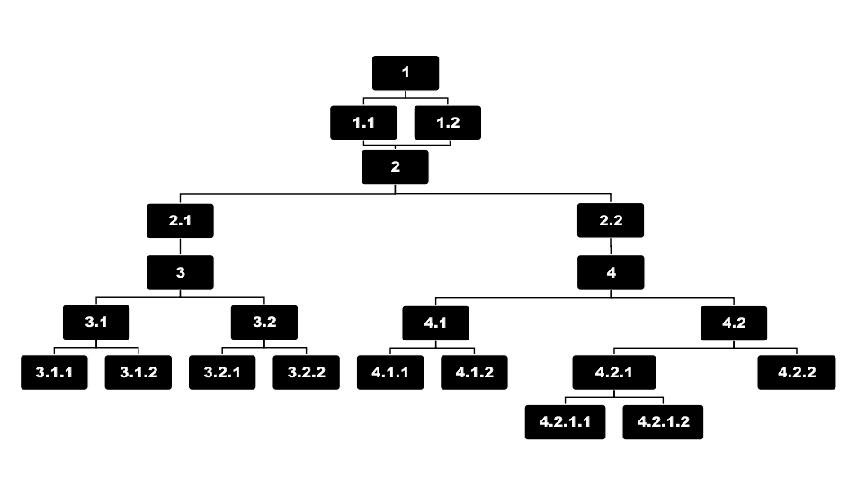

# Project-LaDwC

###Install

1| Copy .env
    
    
    copy .env.example .env // For Windows
    cp .env.example .env // Mac
    php artisan key:generate // generate Key

2| Intall Composer and npm

    composer install 
    npm install

3| run dev or prod

    npm run dev  // Development
    npm run prod // production

4| start serve
    
    php artisan serve
    
5| Open Browser and go to
   http://127.0.0.1:8000/

######Video Constrcution

Links:
- [Composer](https://getcomposer.org/)
- [NodeJS](https://nodejs.org/en/)
